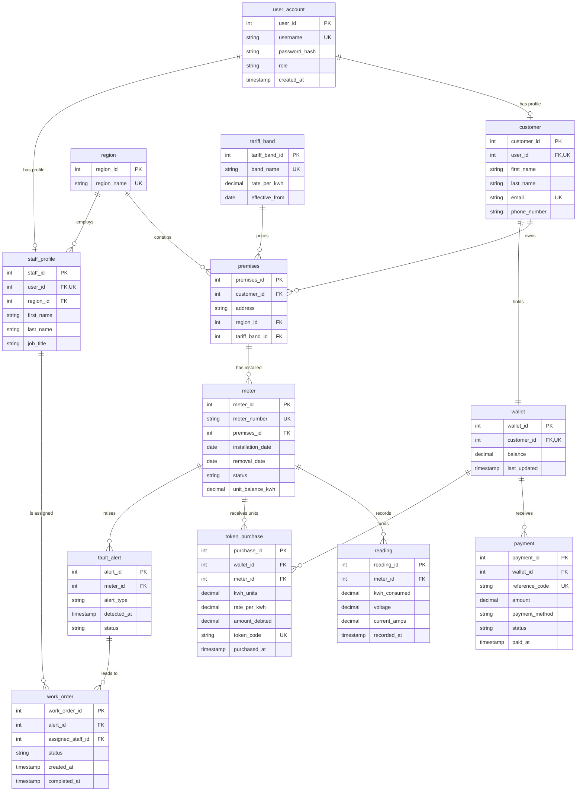

# ER Diagram

Entity-relationship diagram for AOWLYF Dynamics Energy Services (Mermaid). GitHub renders it automatically.

```mermaid
erDiagram
    user_account ||--o| customer : "has profile"
    user_account ||--o| staff_profile : "has profile"
    customer ||--o{ premises : owns
    customer ||--|| wallet : holds
    region ||--o{ premises : contains
    region ||--o{ staff_profile : employs
    tariff_band ||--o{ premises : prices
    premises ||--o{ meter : "has installed"
    meter ||--o{ reading : records
    meter ||--o{ token_purchase : "receives units"
    meter ||--o{ fault_alert : raises
    wallet ||--o{ payment : receives
    wallet ||--o{ token_purchase : funds
    fault_alert ||--o{ work_order : "leads to"
    staff_profile ||--o{ work_order : "is assigned"

    user_account {
        int user_id PK
        string username UK
        string password_hash
        string role
        timestamp created_at
    }
    customer {
        int customer_id PK
        int user_id FK, UK
        string first_name
        string last_name
        string email UK
        string phone_number
    }
    staff_profile {
        int staff_id PK
        int user_id FK, UK
        int region_id FK
        string first_name
        string last_name
        string job_title
    }
    region {
        int region_id PK
        string region_name UK
    }
    tariff_band {
        int tariff_band_id PK
        string band_name UK
        decimal rate_per_kwh
        date effective_from
    }
    premises {
        int premises_id PK
        int customer_id FK
        string address
        int region_id FK
        int tariff_band_id FK
    }
    meter {
        int meter_id PK
        string meter_number UK
        int premises_id FK
        date installation_date
        date removal_date
        string status
        decimal unit_balance_kwh
    }
    reading {
        int reading_id PK
        int meter_id FK
        decimal kwh_consumed
        decimal voltage
        decimal current_amps
        timestamp recorded_at
    }
    wallet {
        int wallet_id PK
        int customer_id FK, UK
        decimal balance
        timestamp last_updated
    }
    payment {
        int payment_id PK
        int wallet_id FK
        string reference_code UK
        decimal amount
        string payment_method
        string status
        timestamp paid_at
    }
    token_purchase {
        int purchase_id PK
        int wallet_id FK
        int meter_id FK
        decimal kwh_units
        decimal rate_per_kwh
        decimal amount_debited
        string token_code UK
        timestamp purchased_at
    }
    fault_alert {
        int alert_id PK
        int meter_id FK
        string alert_type
        timestamp detected_at
        string status
    }
    work_order {
        int work_order_id PK
        int alert_id FK
        int assigned_staff_id FK
        string status
        timestamp created_at
        timestamp completed_at
    }
```
